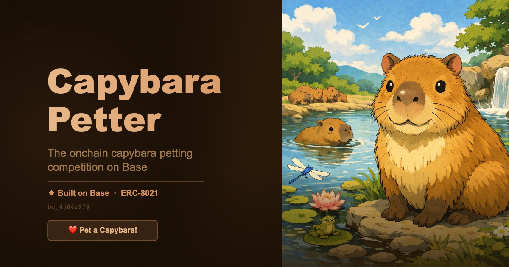

# 🐾 Capybara Petter

The onchain capybara petting competition on **Base mainnet**.

Pet capybaras, climb the leaderboard, become the **Top Petter**.

**Live:** [capybara-petter.vercel.app](https://capybara-petter.vercel.app/)

**Contract:** [`0xe09C6b3A7390Fc24A3E07AcEF9C31AaDb883a9Ba`](https://basescan.org/address/0xe09C6b3A7390Fc24A3E07AcEF9C31AaDb883a9Ba) (Base Mainnet)



## What it is

A single-page dapp where every capybara pet is an onchain transaction on Base. The contract tracks per-wallet pet counts, a global pet counter, and the current Top Petter (the wallet with the most pets). Users can name their petter, climb the leaderboard, and share their pets on X and Farcaster.

The visual is loosely inspired by the [yuzu onsen](https://en.wikipedia.org/wiki/Yuzu) — capybaras are famous hot-spring soakers, so the page reads as a steamy pond with floating citrus, lily pads, and bubbles.

## Features

- **Onchain everything** — every pet is a real transaction on Base mainnet
- **Live leaderboard** with Basenames resolution
- **Streak tracking** (local) and milestone badges (1, 10, 50, 100, 500, 1000 pets)
- **Light + dark theme** with `prefers-color-scheme` auto-detection
- **Sponsored gas** via Base Paymaster (EIP-5792 `wallet_sendCalls`) when the wallet supports it; falls back to regular `eth_sendTransaction`
- **Multi-wallet** — EIP-6963 discovery, Coinbase Smart Wallet SDK, injected fallback
- **Farcaster Mini App** — runs natively in Warpcast with auto-connect
- **base.dev registered** app
- **ERC-8021 attribution** wired into every transaction (builder code `bc_4j84s978`)
- **Bottom navigation bar** for mobile-friendly section jumping
- **Share to X / Warpcast** with one click
- **No build step** — single `index.html`, deploys to anything

## Stack

- `index.html` — vanilla HTML/CSS/JS, no framework, no build
- `CapybaraPetter.sol` — Solidity 0.8.24, deployed on Base mainnet
- `@farcaster/miniapp-sdk` via ESM for Mini App embedding
- `@coinbase/wallet-sdk` via ESM for Smart Wallet support
- Direct `eth_call` / `eth_sendTransaction` / `wallet_sendCalls` against a public Base RPC — no wallet library
- Custom keccak256 implementation for Basenames reverse resolution

## Deploy

The repo auto-deploys to Vercel on push to `main`.

## Contract

```solidity
function petCapybara() external;
function setPetterName(string calldata name) external;
function getPetterStats(address petter) external view returns (uint256 pets, string memory name, bool isTop);
```

## License

MIT — see [LICENSE](LICENSE).
